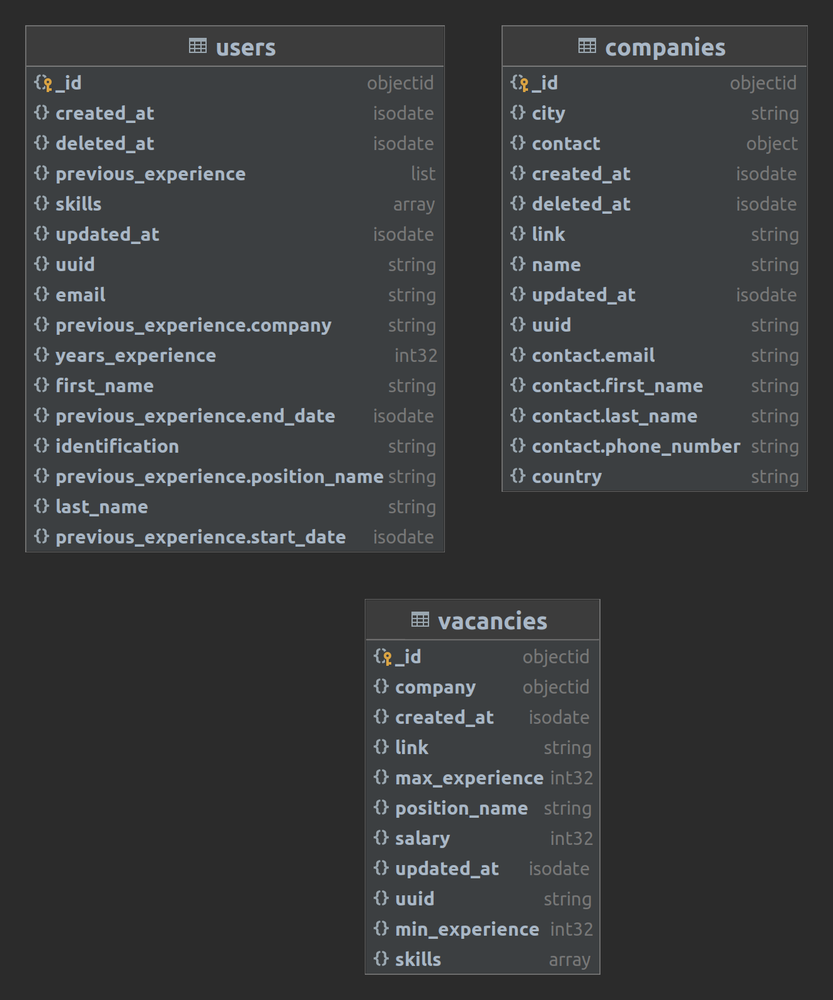

# Microservice Hunty Test

-   Language: Python3
-   Framework: FastApi
-   Database: MongoDB
-   Container: Docker


## Dependencies

- Docker

### Installation docker

Documentation for install docker [here](https://docs.docker.com/engine/install/)

### Install docker-compose for development

Documentation for install docker-compose [here](https://docs.docker.com/compose/install/)

Copy .env.example to .env
```
$ cp .env.example .env
```

**Env vars**

```
APP_ENV=local
SENTRY_DSN=

# Connect Mongo
MONGO_URI=mongodb://{your_ip}:27017/hunty
```

**Run project locally docker-compose**
```
$ git clone https://github.com/joaco1826/hunty.git
$ docker-compose up --build
```

# Installation virtualenv

1.  Install Virtualenv and activate it

```
$ python3 -m venv venv
```

```
$ source venv/bin/activate
```

2.  Install requirements.txt

```
$ pip3 install -r requirements.txt
```
-   Libraries:
    - fastApi
    - mongoengine
    - mongoengine-goodjson
    - pydantic
    - pytest
    - sentry-sdk
    - spectree
    - uvicorn

**Run server**
```
$ uvicorn config.settings:app --host=localhost --port=8001 --reload --log-level=info
```

3. Status services [health](https://0.0.0.0:8001/health)


4. Documentation
[here](https://0.0.0.0:8001/docs)

5. Docker Hub
```
$ docker pull joaco1826/hunty-test:latest
```

6. Run docker app
```
$ docker run --name hunty_app --env-file .env -p 8001:8001 -d joaco1826/hunty-test
```

7. Run docker mongo
```
$ docker run -d -p 27017:27017 --name mongo-hunty mongo:4.2.2
```

### Diagram




Author: Joaquin Forero - [LinkedIn](https://www.linkedin.com/in/joaquin-forero-olaciregui/)
